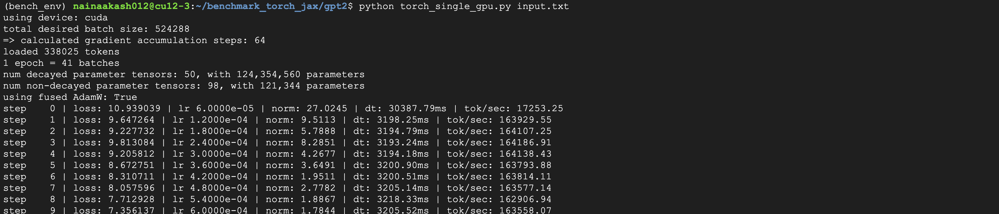

# benchmark_torch_jax
The idea behind this repository is to build a set of models both in JAX and torch so that they can be used to compare the
performance difference between the two frameworks on different hardwares. The objective is to help the developers of the
frameowrks to identify the potential gaps/bugs that can be addressed at the library level

**Note:** The code in this repository sevres the purpose of benchmarking. For most cases, we will try to use standalone py file for each
framework. Once the benchmark is done, we can refactor and format the code to make it more prettier, but it's not the end goal of this
particular codebase

# Results

#### GPT-2
Initial results with JAX and Equinox on A100

Initial results with torch on A100

